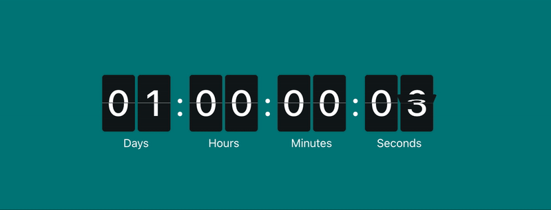

# react-flip-clock-countdown

> A 3D animated countdown component for React.

[](https://www.npmjs.com/package/react-flip-clock-countdown) [](https://standardjs.com)

<div align="center">
  
</div>

## Install

```bash
npm install --save react-flip-clock-countdown
```

## Usage

```tsx
import React, { Component } from 'react';

import FlipClockCountdown from 'react-flip-clock-countdown';
import 'react-flip-clock-countdown/dist/index.css';

class Example extends Component {
  render() {
    return <FlipClockCountdown to={new Date().getTime() + 24 * 3600 * 1000 + 5000} />;
  }
}
```

## License

MIT © [leenguyen](https://github.com/sLeenguyen)
